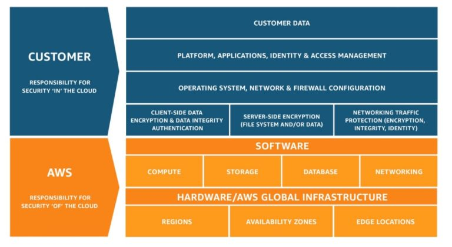
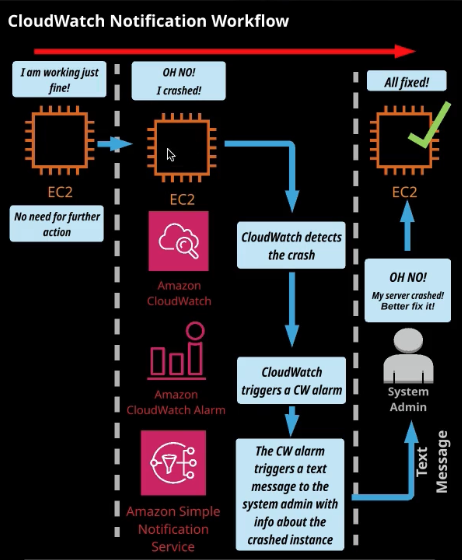

# Domain 2: Security and Compliance

<!-- TOC -->

- [Domain 2: Security and Compliance](#domain-2-security-and-compliance)
    - [Define the AWS shared responsibility model](#define-the-aws-shared-responsibility-model)
        - [Recognize the elements of the Shared Responsibility Model](#recognize-the-elements-of-the-shared-responsibility-model)
        - [Describe the customer's responsibilities on AWS](#describe-the-customers-responsibilities-on-aws)
            - [Describe how the customer's responsibilities may shift depending on the service used (for example with RDS, Lambda, or EC2)](#describe-how-the-customers-responsibilities-may-shift-depending-on-the-service-used-for-example-with-rds-lambda-or-ec2)
        - [Describe AWS responsibilities](#describe-aws-responsibilities)
    - [Define AWS Cloud security and compliance concepts](#define-aws-cloud-security-and-compliance-concepts)
        - [AWS Key Management Service (KMS)](#aws-key-management-service-kms)
        - [Identify where to find AWS compliance information](#identify-where-to-find-aws-compliance-information)
            - [Locations of lists of recognized available compliance controls (for example, HIPPA, SOCs)](#locations-of-lists-of-recognized-available-compliance-controls-for-example-hippa-socs)
            - [Recognize that compliance requirements vary among AWS services](#recognize-that-compliance-requirements-vary-among-aws-services)
        - [At a high level, describe how customers achieve compliance on AWS](#at-a-high-level-describe-how-customers-achieve-compliance-on-aws)
            - [Identify different encrpytion options on AWS (for example, In transit, At rest)](#identify-different-encrpytion-options-on-aws-for-example-in-transit-at-rest)
        - [Describe who enables encryption on AWS for a given service](#describe-who-enables-encryption-on-aws-for-a-given-service)
        - [Recognize there are services that will aid in auditing and reporting](#recognize-there-are-services-that-will-aid-in-auditing-and-reporting)
            - [Recognize that logs exist for auditing and monitoring (do not have to understand the logs)](#recognize-that-logs-exist-for-auditing-and-monitoring-do-not-have-to-understand-the-logs)
            - [Define Amazon CloudWatch, AWS Config, and AWS CloudTrail](#define-amazon-cloudwatch-aws-config-and-aws-cloudtrail)
        - [Explain the concept of least privileged access](#explain-the-concept-of-least-privileged-access)
    - [Identify AWS access management capabilities](#identify-aws-access-management-capabilities)
        - [Understand the purpose of User and Identity Management](#understand-the-purpose-of-user-and-identity-management)
            - [Access keys and password policies (rotation, complexity)](#access-keys-and-password-policies-rotation-complexity)
            - [Multi-Factor Authentication (MFA)](#multi-factor-authentication-mfa)
            - [AWS Identity and Access Management (IAM)](#aws-identity-and-access-management-iam)
                - [Policies, managed policies compared to custom policies](#policies-managed-policies-compared-to-custom-policies)
            - [Tasks that require user of root accounts](#tasks-that-require-user-of-root-accounts)
            - [Protection of root accounts](#protection-of-root-accounts)
    - [Identify resources for security support](#identify-resources-for-security-support)
        - [Recognize there are different network security capabilities](#recognize-there-are-different-network-security-capabilities)
            - [Native AWS services (for example, security groups, Network ACLs, AWS WAF)](#native-aws-services-for-example-security-groups-network-acls-aws-waf)
            - [3 rd party security products from the AWS Marketplace](#3-rd-party-security-products-from-the-aws-marketplace)
        - [Recognize there is documentation and where to find it (for example, best practices, whitepapers, official documents)](#recognize-there-is-documentation-and-where-to-find-it-for-example-best-practices-whitepapers-official-documents)
            - [AWS Whitepapers](#aws-whitepapers)
            - [AWS Service Documentation](#aws-service-documentation)
            - [AWS Knowledge Center, Security Center, security forum, and security blogs](#aws-knowledge-center-security-center-security-forum-and-security-blogs)
            - [Partner Systems Integrators](#partner-systems-integrators)
        - [Know that security checks are a component of AWS Trusted Advisor](#know-that-security-checks-are-a-component-of-aws-trusted-advisor)

<!-- /TOC -->

## Define the AWS shared responsibility model

Security and compliance is a shared responsibility between AWS and its customers. The _Shared Responsibility Model_ defines what you (as an AWS account holder/user) and AWS are responsible for when it comes to security and compliance. 

### Recognize the elements of the Shared Responsibility Model

### Describe the customer's responsibilities on AWS

The customer assumes responsibility and management of the guest operating system (including updates and security patches), other associated application software as well as the configuration of the AWS provided security group firewall.

#### Describe how the customer's responsibilities may shift depending on the service used (for example with RDS, Lambda, or EC2)

Customers should carefully consider the services they choose as their responsibilities vary depending on the services used. For example, a service such as EC2 is categorized as IaaS and, as such, requires to customer to perform all of the necessary security configration and management tasks.

For abstracted services, such as Amazon S3 and Amazon DynamoDB, AWS operates the infrastructure layer, the operating system, and platforms, and customers access the endpoints to store and retrieve data. Customers are responsible for managing their data, classifying their assets, and using IAM tools to apply the appropriate permissions.

### Describe AWS responsibilities

AWS operates, manages, and controls the components from the host operating system and virtualization layer down to the physical security of the facilities in which the service operates. In addition to the Shared Responsibility Model, DDoS protection is built-in / mitigated by many core AWS services.

## Define AWS Cloud security and compliance concepts

AWS customers are welcome to carry out security assessments or penetration tests against some of their AWS infrastructure without prior approval. This applies to seven services:

* AWS EC2 instances, NAT Gateways, and ELBs
* Amazon RDS (including Amazon Aurora DB serverless)
* Amazon CloudFront
* Amazon API Gateways
* AWS Lambda and Lambda Edge functions
* Amazon Lightsail resources
* Amazon Elastic Beanstalk environments

**Prohibited Activities**

These activities are not allowed at this time:

* DNS zone walking via Route 53 hosted zones
* DoS, DDoS, simulated DoS, simulated DDoS
* Port flooding
* Protocol flooding
* Request flooding

**Other AWS Security-Related Services**

* **AWS Organizations** allows for centralized management of AWS accounts and billing, but it can also define policies that restrict, at the account level, what services and actions member accounts may take.

* **Amazon GuardDuty** is a threat detection service that provides a way to continuously monitor and protect AWS accounts and workloads. GuardDuty uses threat intelligence feeds to actively detect threats to the environment.

* **Amazon Inspector** analyzes the VPC environment for potential security issues. Inspector uses a defined template and assesses the environment. It provides the findings and recommends steps to resolve any potential security issues found.

* **AWS Shield** provides managed DDoS protection. DDoS attacks happen when multiple compromised systems attempt to flood a target with traffic. That target could be DNS, a web appication, or a network.

* **AWS Web Application Firewall (WAF)** monitors web requests forwarded by an ELB, CloudFront, or API Gateway. WAF can allow or deny access to content based on specified conditions.

* **AWS Artifact** is a portal that provides access to AWS compliance documentation, such as payment card industry (PCI) and ISO certifications, and System and Organization Control (SOC) reports.

### AWS Key Management Service (KMS)

**AWS Key Management Service (KMS)** enables encryption of data and provides a centralized encryption key storage, management, and auditing. The data may be encrypted for use with applications or to encrypt data stored on AWS.

AWS KMS uses _FIPS 140-2_ validated hardware security modules to protect your keys. AWS KMS is integrated with AWS CloudTrail to provide you with logs of all key usage to help meet your regulatory and compliance needs.

AWS KMS key facts:

* Keys may be generated in KMS, in an *AWS Cloud Hardware Security Module (CloudHSM)* hardware cluster, or you may import keys from your own encryption key service.

* Data is submitted directly to KMS for encryption/decryption using the master keys.

* KMS integrates with other AWS services, including S3, Storage Gateway, EBS and RDS, DynamoDB, SNS, CloudTrail.

### Identify where to find AWS compliance information

#### Locations of lists of recognized available compliance controls (for example, HIPPA, SOCs)

#### Recognize that compliance requirements vary among AWS services

### At a high level, describe how customers achieve compliance on AWS

#### Identify different encrpytion options on AWS (for example, In transit, At rest)

### Describe who enables encryption on AWS for a given service

### Recognize there are services that will aid in auditing and reporting

#### Recognize that logs exist for auditing and monitoring (do not have to understand the logs)

#### Define Amazon CloudWatch, AWS Config, and AWS CloudTrail

**CloudWatch** is a service that allows you to monitor your AWS resources and the applications you run on AWS in real time. You can use CloudWatch to collect and track metrics, send notifications, or automatically make changes to the resources you are monitoring based on rules that you define.

By default, CloudWatch does not send out notifications unless you setup a **Simple Notification Service (SNS)** and associate it with the monitoring alarm. Alternatively, you could use the dashboard to view metrics that you selected, such as EC2 CPU utliziation, S3 bucket size, or billing.

CloudWatch by default gives metrics that checks every 5 minutes for free, but if you go below the 5 minutes period you could be billed for those checks.

**CloudWatch Benefits**

* monitor metrics for almost all your AWS resources
* create and monitor custom metrics
* create custom dashboards for easy viewing of metrics
* monitor and store logs
* set alarms and events (and trigger actions based on them)

**CloudTrail**

**CloudTrail** is a service that enables governance, compliance, operational auditing, and risk auditing of your AWS account. It allows you to monitor all actions taken by IAM users, including services accessed and actions taken by them, such as who deleted an S3 object.

CloudTrail provides event history of your AWS account activity including actions taken through the AWS Management Console, AWS SDKs, command line tools, and other AWS services. This event history simplifies security analysis, resource change tracking, and troubleshooting.

When you create a CloudTrail you may specify what events to log, such as all, read-only or write-only, and where to saved those events, i.e. into an S3 bucket or invoke a Lambda function.

**Simple Notification Service (SNS)**

**Simple Notification Service (SNS)** is an AWS service that allows you to automate the sending of email or text message notifications, based on events that happen in your AWS account. In SNS, there are two types of clients - _publishers_ and _subscribers_ - also referred to as producers and consumers.

**SNS Components**

_Topics_ are how you label and group different _endpoints_ that you send messages to.

_Subscribers_ or endpoints, such as web servers, email addresses, Amazon SQS queues, AWS Lambda functions, consume or receive the message over one of the supported protocols - Amazon SQS, HTTP/S, email, SMS, Lambda - when they are subscribed to the topic.

_Publishers_ communicate _asynchronously_ with subscribers by producing and sending a message to a topic, which is a logical access point and communication channel.

**SNS Benefits**

* send automated - events and alarms - or manual notifications
* send notification to supported protocols, such as email, SMS, HTTP/S, Amazon SQS, Amazon Lambda
* closely integrates with other AWS services, such as CloudWatch

**Simple Queue Service (SQS)**

**Amazon Simple Queue Service (SQS)** is a message queuing service that you can send, store, and receive messages between software components, without losing messages or requiring other services to be available. An application sends messages into a queue, then a user or service retrieves a message from the queue, process it, and then deletes it from the queue.

### Explain the concept of least privileged access

## Identify AWS access management capabilities

### Understand the purpose of User and Identity Management

#### Access keys and password policies (rotation, complexity)

#### Multi-Factor Authentication (MFA)

**Multi-Factor Authentication (MFA)** is an additional layer of security on your root account that is provided by a third party. It provides a continually changing, random, six-digit code you need to input (along with your password) when logging in to your root account.

**How do you get an MFA code?**
* Virtual MFA device
  * Smartphone or tablet
  * Commonly used app (iOS and Android): Google Authenticator
* Hardware key fob
  * Small physical device with a display that you can attach to your keychain
  * Ordered directly from AWS
* API keys for programmatic (CLI) access
  * Special credentials required for accessing AWS resources via the command line interface (CLI)

#### AWS Identity and Access Management (IAM)

**Identity and Access Management (IAM)** is the service where AWS user accounts and their access to various AWS services is managed. The common use of IAM is to manage:

* Users
* Groups
* Access policies
* Roles
* User credentials
* User password policies
* Multi-factor authentication (MFA)
* API keys for programmatic (CLI) access

The user created when you create an AWS account is called the _root_ user. By default the root user has full administrative rights and access to every part of the account.

Any new or additional users created in the AWS account are created with no access to any AWS resources. The only granted access it the ability to log in.

The reason is that AWS operates on the principle of _least privilege_. For a user to access an AWS service, permission must be granted to that user, which is managed in/by IAM.

**IAM Best Practices**

These are guidelines that recommend settings, configurations, and architecture for maintaining a high level of security, accessibility, and efficiency.

When a new AWS root account is created, it is best practice to complete the tasks listed in IAM under _Security Status_, including:

* Delete your root access keys
* Activate MFA on your root account
* Create individual IAM users
* Use groups to assign permissions
* Apply an IAM password policy

Best practice is to never use your root account for day-to-day use. If you want full admin access, create an IAM user and attach the **AdministratorAccess** policy to it, and use this as your daily login account.

**IAM Groups**

An IAM group is a collection of IAM users. Groups allow you to set and manage permissions for multiple users at the same time.

Groups are a more convenient and efficient way to manage account permissions. For example, if our user James were to switch positions within the company, we could easily remove James from his old group and add him to the new group.

**IAM Password Policy**

A _password policy_ dictates the format and expiration rules that a user must follow when creating or modifying their password. These rules include the following requirements:

* Length
* Case
* Number
* Non-alphanumeric
* Password expiration
* Password reuse
* User rights to change their own password
* Administrator reset

**IAM Users**

IAM users are individuals who have been granted access to an AWS account. Each IAM user has three main components:

* A username
* A password
* Permissions to access various AWS services

Without permissions being explicitly granted to an IAM user, that user will not be able to access any AWS services. Generally, a company's IT department will be responsible for attaching IAM permission policies to an IAM user based on what the user needs to access to (in order to do their job).

**IAM Roles**

An **IAM role** is an identity that you can assume to gain temporary access to permissions. When someone assumes an IAM role, they abandon all permissions that they had under a previous role and assume the permissions of the new role.

IAM roles are AWS services that have been granted access to another AWS service. For example, an EC2 instance may require access to an S3 bucket, hence we attach an IAM role with the appropriate S3 permissions to the EC2 instance.

##### Policies, managed policies compared to custom policies

**Inline policies** are policies that are assigned to an IAM user.

#### Tasks that require user of root accounts

#### Protection of root accounts

## Identify resources for security support

### Recognize there are different network security capabilities

#### Native AWS services (for example, security groups, Network ACLs, AWS WAF)

#### 3rd party security products from the AWS Marketplace

### Recognize there is documentation and where to find it (for example, best practices, whitepapers, official documents)

#### AWS Whitepapers

**AWS Whitepapers** is a collection of technical documents that outline many AWS relevant topics, including (but not limited to):
* Architecture best practices
* Security best practices
* Cloud computing economics
* Serverless architecture

All whitepapers have been reviewed and approved by AWS, independent analysts, or the AWS community (customers or partners).

#### AWS Service Documentation

**AWS Service Documentation** is a collection of documents specific to each AWS service. They provide detailed technical explanations and walkthroughs on how to use each service and feature.

#### AWS Knowledge Center, Security Center, security forum, and security blogs

#### Partner Systems Integrators

### Know that security checks are a component of AWS Trusted Advisor

