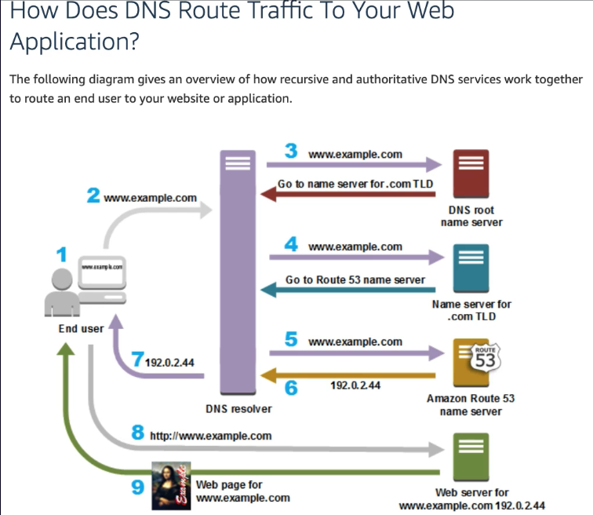

# Domain 3: Technology

<!-- TOC -->

- [Domain 3: Technology](#domain-3-technology)
    - [Define methods of deploying and operating in the AWS Cloud](#define-methods-of-deploying-and-operating-in-the-aws-cloud)
        - [Describe the shared responsibility model](#describe-the-shared-responsibility-model)
        - [Describe Infrastructure-as-a-Service (IaaS)](#describe-infrastructure-as-a-service-iaas)
        - [Describe Platform-as-a-Service (PaaS)](#describe-platform-as-a-service-paas)
        - [Describe serverless computing](#describe-serverless-computing)
        - [Describe Software-as-a-Service (SaaS)](#describe-software-as-a-service-saas)
        - [Identify at a high level different ways of provisioning and operating in the AWS cloud](#identify-at-a-high-level-different-ways-of-provisioning-and-operating-in-the-aws-cloud)
        - [Identify different types of cloud deployment models](#identify-different-types-of-cloud-deployment-models)
        - [Compare and contrast the three types of cloud computing](#compare-and-contrast-the-three-types-of-cloud-computing)
        - [Benefits of cloud computing](#benefits-of-cloud-computing)
        - [Identify connectivity options](#identify-connectivity-options)
        - [Identify compute options](#identify-compute-options)
        - [Benefits and Use Cases](#benefits-and-use-cases)
        - [Identify storage options](#identify-storage-options)
    - [Define the AWS global infrastructure](#define-the-aws-global-infrastructure)
        - [Describe the relationships among Regions, Availability Zones, and Edge Locations](#describe-the-relationships-among-regions-availability-zones-and-edge-locations)
        - [Describe how to achieve high availability through the use of multiple Availability Zones](#describe-how-to-achieve-high-availability-through-the-use-of-multiple-availability-zones)
            - [Recall that high availability is achieved by using multiple Availability Zones](#recall-that-high-availability-is-achieved-by-using-multiple-availability-zones)
            - [Recognize that Availability Zones do not share single points of failure](#recognize-that-availability-zones-do-not-share-single-points-of-failure)
        - [Describe when to consider the use of multiple AWS Regions](#describe-when-to-consider-the-use-of-multiple-aws-regions)
            - [Disaster recovery/business continuity](#disaster-recoverybusiness-continuity)
            - [Low latency for end-users](#low-latency-for-end-users)
            - [Data sovereignty](#data-sovereignty)
        - [Describe at a high level the benefits of Edge Locations](#describe-at-a-high-level-the-benefits-of-edge-locations)
            - [Amazon CloudFront](#amazon-cloudfront)
            - [AWS Global Accelerator](#aws-global-accelerator)
    - [Identify the core AWS services](#identify-the-core-aws-services)
        - [Describe the categories of services on AWS (compute, storage, network, database)](#describe-the-categories-of-services-on-aws-compute-storage-network-database)
        - [Identify AWS compute services](#identify-aws-compute-services)
            - [Recognize there are different compute families](#recognize-there-are-different-compute-families)
            - [Recognize the different services that provide compute (for example, AWS Lambda compared to Amazon Elastic Container Service (Amazon ECS), or Amazon EC2, etc.)](#recognize-the-different-services-that-provide-compute-for-example-aws-lambda-compared-to-amazon-elastic-container-service-amazon-ecs-or-amazon-ec2-etc)
            - [Recognize that elasticity is achieved through Auto Scaling](#recognize-that-elasticity-is-achieved-through-auto-scaling)
            - [Identify the purpose of load balancers](#identify-the-purpose-of-load-balancers)
        - [Identify different AWS storage services](#identify-different-aws-storage-services)
            - [Describe Amazon S3](#describe-amazon-s3)
            - [Describe Amazon Elastic Block Store (Amazon EBS)](#describe-amazon-elastic-block-store-amazon-ebs)
            - [Describe Amazon S3 Glacier](#describe-amazon-s3-glacier)
            - [Describe AWS Snowball](#describe-aws-snowball)
            - [Describe Amazon Elastic File System (Amazon EFS)](#describe-amazon-elastic-file-system-amazon-efs)
            - [Describe AWS Storage Gateway](#describe-aws-storage-gateway)
        - [Identify AWS networking services](#identify-aws-networking-services)
        - [Networking Security](#networking-security)
            - [Identify the purpose of Amazon Route 53](#identify-the-purpose-of-amazon-route-53)
            - [Identify VPN, AWS Direct Connect](#identify-vpn-aws-direct-connect)
        - [Idenfify different AWS database services](#idenfify-different-aws-database-services)
            - [Install databases on Amazon EC2 compared to AWS managed databases](#install-databases-on-amazon-ec2-compared-to-aws-managed-databases)
            - [Identify Amazon RDS](#identify-amazon-rds)
            - [Identify Amazon DynamoDB](#identify-amazon-dynamodb)
            - [Identify Amazon ElastiCache](#identify-amazon-elasticache)
            - [Identify Amazon Redshift](#identify-amazon-redshift)
    - [Other AWS Services](#other-aws-services)
        - [AWS Analytics](#aws-analytics)
            - [Amazon Athena](#amazon-athena)
            - [Amazon EMR](#amazon-emr)
            - [Amazon Lightsail](#amazon-lightsail)
            - [Amazon Rekognition](#amazon-rekognition)
            - [Amazon Device Farm (Mobile Lab)](#amazon-device-farm-mobile-lab)
            - [Amazon Mechanical Turk](#amazon-mechanical-turk)
        - [Artificial Intelligence](#artificial-intelligence)
        - [Machine Learning](#machine-learning)
    - [Idenfify resources for technology support](#idenfify-resources-for-technology-support)
        - [Recognize there is documentation (best practices, whitepapers, AWS Knowledge Center, forums, blogs)](#recognize-there-is-documentation-best-practices-whitepapers-aws-knowledge-center-forums-blogs)
        - [Identify the various levels and scope of AWS support](#identify-the-various-levels-and-scope-of-aws-support)
            - [AWS Abuse](#aws-abuse)
            - [AWS support cases](#aws-support-cases)
            - [Premium support](#premium-support)
            - [Technical Account Managers](#technical-account-managers)
        - [Recognize there is a partner network (marketplace, third-party) including independent Software Vendors and System Integrators](#recognize-there-is-a-partner-network-marketplace-third-party-including-independent-software-vendors-and-system-integrators)
        - [Identify sources of AWS technical assistance and knowledge including professional services, solution architects, training and certification, and the Amazon Partner Network](#identify-sources-of-aws-technical-assistance-and-knowledge-including-professional-services-solution-architects-training-and-certification-and-the-amazon-partner-network)
        - [Identify the benefits of using AWS Trusted Advisor](#identify-the-benefits-of-using-aws-trusted-advisor)

<!-- /TOC -->

## Define methods of deploying and operating in the AWS Cloud

### Describe the shared responsibility model

Cloud computing falls into one of the following computing models. These models define the different level of shared responsibility that a cloud provider and cloud tenant are responsible for.

### Describe Infrastructure-as-a-Service (IaaS)

**IaaS** model is the closest to managing physical servers. A cloud provider keeps hardware up to date, but a cloud tenant maintains operating system and network configuration.

An advantage of this model is rapid deployment of new compute devices, e.g. EC2. Setting up a new VM is considerably faster than procuring, installing and configuring a physical server.

### Describe Platform-as-a-Service (PaaS)

**PaaS** model is a managed hosting environment. A cloud provider manages the virtual machines and networking resources, while a cloud tenant deploys their applications into the managed hosting environment.

An advantage of this model is a cloud tenant does not have to deal with both physical hardware and software requirements. An example of PaaS is AWS Elastic Beanstalk.

### Describe serverless computing

**Serverless** computing is where a cloud provider automatically provisions, scales and manages the infrastructure required to run the code. Overlapping with PaaS, serverless architectures are highly scalable and event-driven as they use resources only when a specific function or trigger occurs.

It's important to note that servers are still running the code. The "serverless" name comes from the fact that tasks associated with infrastructure provisioning and management are invisible to a cloud tenant.

An advantage of this model is a cloud tenant can focus on the business logic and help teams increase their productivity and bring products to market faster. It allows organizations to better optimize resources and stay focused on innovation.

### Describe Software-as-a-Service (SaaS)

**SaaS** model is where a cloud provider manages all aspects of the application environment, including VMs, networking resources, data storage, and applications. A cloud tenant only needs to provide their data to the application managed by the cloud provider.

An advantage of this model is you need only to create your content as the SaaS will take care of everything else, e.g. S3.

### Identify at a high level different ways of provisioning and operating in the AWS cloud

**AWS Elastic Beanstalk**

**AWS Elastic Beanstalk** is a service that helps you provision Amazon EC2-based environments. Instead of clicking around the console or writing multiple commands to build out your network, EC2 instances, ELBs, you can instead provide your application code and desired configurations to the AWS Elastic Beanstalk service, which then takes that information and builds out your environment for you.

It deploys the resources necessary to perform the following tasks:
* adjust capacity
* load balancing
* automatic scaling
* application health monitoring

**AWS CloudFormation**

**AWS CloudFormation** is an infrastructure as code tool that allows you to define a wide variety of AWS resources in declarative way using JSON or YAML files called CloudFormation templates. It provisions your resources in a safe and repeatable manner.

**Programmatic access, APIs, SDKs, AWS Management Console, CLI, Infrastructure as Code**

**AWS Management Console**

Access to AWS services via a graphical user interface (GUI). 

* Administer your AWS account.
* Search and navigate to services.
* Personalize your console with service shortcuts.
* Tag resources for easy identification and editing.
* Create resource groups for collections of related resources.
* Access helpful resources for learning about AWS services and features.

**API Access**

Interact programmatically with AWS services via AWS CLI. All IaaS AWS administration, management and functions in the AWS Management Console are available in the AWS API and CLI.

The AWS CLI provides direct access to the public APIs of AWS services. You can explore a service's capabilities with the AWS CLI, and develop shell scripts to manage your resources. 

In addition to the low-level, API-equivalent commands, several AWS services provide customizations for the AWS CLI. Customizations can include higher-level commands that simplify using a service with a complex API.

For example, the `aws s3` set of commands provide a familiar syntax for managing files in **Amazon Simple Storage Service (Amazon S3)**.

### Identify different types of cloud deployment models

The three cloud computing deployment models are cloud-based, on-premises, and hybrid. There are three deployment models for cloud computing: _public cloud_, _private cloud_, and _hybrid cloud_.

Cloud computing is the deliver of computing services over the internet, which is otherwise known as the cloud. These services include servers, storage, databases, networking, analytics, and intelligence.

**All in with cloud/cloud native**

Services are offered over the public internet and available to anyone who wants to purchase them. Public cloud resources are hosted by a third-party service provider.

In a **cloud-based deployment** model, you can migrate existing applications to the cloud, or you can design and build new applications in the cloud. You can build those applications on low-level infrastructure that requires your IT staff to manage them. Alternatively, you can build them using higher-level services that reduce the management, architecting, and scaling requirements of the core infrastructure.

* Run all parts of the application in the cloud.
* Migrate existing applications to the cloud.
* Design and build new applications in the cloud.

**Hybrid**

Computing resources that are hosted by both a public cloud and a private cloud by allowing data and applications to be shared between them.

In this model, the public cloud effectively becomes an extension of the private cloud to form a single, uniform cloud.

In a **hybrid deployment**, cloud-based resources are connected to on-premises infrastructure. For example, you have legacy applications that are better maintained on premises, or government regulations require your business to keep certain records on premises.

* Connect cloud-based resources to on-premises infrastructure.
* Integrate cloud-based resources with legacy IT applications.

**On-premises**

Computing resources are used exclusively by users from one business or organization. A private cloud can be physically located at your organization's on-site datacenter, or by a third-party service provider.

**On-premises deployment** is also known as a private cloud deployment. Though this model is much like legacy IT infrastructure, its incorporation of application management and virtualization technologies helps to increase resource utilization.

* Deploy resources by using virtualization and resource management tools.
* Increase resource utilization by using application management and virtualization technologies.

### Compare and contrast the three types of cloud computing

The two characteristics of public cloud are metered pricing and self-service management.

The two characteristics of private cloud are dedicated hardware and inadequate SLA.

The characteristic of hybrid cloud is a high level of compatibility between the underlying software and services used by both the public and private clouds.

### Benefits of cloud computing

* Trade upfront expense for variable expense
* Stop spending money to run and maintain data centers
* Stop guessing capacity
* Benefit from massive economies of scale
* Increase speed and agility
* Go global in minutes

### Identify connectivity options

**VPN**

A Virtual Private Gateway (VPG) allows you to access private resources in a VPC. A VPG enables you to establish a virtual private network (VPN) between your VPC and a private network, such as on-premises data center.

A VPG allows traffic into the VPC only if it's coming from an approved network. The bodyguard is like a VPN connection that encrypts (or protects) your internet traffic from all the other requests around it.

The VPG is the component that allows protected internet traffic to enter the VPC. Although your connection has extra protection, it still uses the Internet as other customers.

**AWS Direct Connect**

**AWS Direct Connect** is a service that enables you to establish a dedicated private connection between your data center and a VPC. It allows you to connect your on-premises environment with a low-latency, high-speed connection to the AWS environment.

AWS Direct Connect allows protected traffic into the VPC, but unlike a VPG, it does not use the Internet.

**Linux Bastion Host**

**Linux Bastion Host** allows you to connect from the Internet to an EC2 instance within a private subnet. Linux Bastion Host can be setup quickly using the **AWS Quick Start** templates.

**Public internet**

**Route 53** has to do with Domain Name Services (DNS), which maps a domain name to an IP address.

### Identify compute options

**EC2**

An _Elastic Compute Cloud (EC2)_ is a virtual server that you can provision an instance, and configure the OS and software environment. Think of EC2 as a basic computer.

Amazon EC2 provides scalable computing capacity in the AWS cloud. Using EC2 eliminates your need to invest in hardware up front, so you can develop and deploy applications faster.

You can use EC2 to launch as many or as few virtual servers as you need, configure security and networking, and manage storage. Amazon EC2 enables you to scale up or down to handle changes in requirements or spikes in popularity, reducing your need to forecast traffic.

**AMI**

An _Amazon Machine Image (AMI)_ is a preconfigured package required to launch an EC2 instance that includes an operating system, software packages, and other required settings.

**AMI Options**

AMIs come in three main categories:

1. Community AMIs
  * Free to use
  * Generally, with these AMIS, you just select the OS you want

2. AWS Marketplace AMIs
  * Pay to use
  * Generally comes packaged with additional, licensed software

3. My AMIs
  * AMIs you create yourself

**Instance Type Options**

1. General purpose

_General purpose_ instances provide a balance of compute, memory, and networking resources. You can use them for a variety of workloads, such as application, gaming, backend, and databases.

2. Compute optimized

_Compute optimized_ instances are ideal for compute-bound applications that benefit from high-performance processors, such as high-performance web servers, compute-intensive applications, dedicated gaming servers, and batch processing workloads.

3. Accelerated computing

_Accelerated computing_ instances use hardware accelerators, or coprocessors, to perform some functions more efficently than is possible in software running on CPUs that are ideal for graphics, game and application streaming. Examples of these functions include floating-point number calculations, graphics processing, and data pattern matching.

4. Memory optimized

_Memory optimized_ instances are designed to deliver fast performance for workloads that process large datasets in memory. This scenario might be a high-performance database or a workload that involves performing real-time processing of a large amount of unstructured data.

5. Storage optimized

_Storage optimized_ instances are designed for workloads that require high, sequential read and write access to large datasets on local storage. Examples of workloads include distributed file systems, data warehousing applications, and high-frequency online transaction processing (OLTP) systems.

In computing, the term Input/Output operations Per Second (IOPS) is a metric that measures the performance of a storage device. It indicates how many different inputs or output operations a device can perform in one second.

Storage optimized instances are designed to deliver tens of thousands of low-latency, random IOPS to applications.

**Instance Type Components**

* Family: A way of categorizing instance types based on what they are optimized to do
* Type: Subcategory for each family type
* vCPUs: The number of virtual CPUs the instance type uses
* Memory (GiB): The amount of RAM the instance type uses
* Instance storage (GiB): The local instance storage volume (your hard drive)
* EBS-optimized available: Indicates if EBS-optimized is an option for the instance type
* Network performance: Network performance rating based on its data transfer rate (bandwidth capability)

**AMI Components**

When you create an AMI, you are essentially creating a template you can use to launch another EC2 instance that has the exact same components as the original.

1. Root volume template
  * Operating system
  * Application software
2. Launch permissions
3. Block device mapping
  * EBS (hard drive mapping)

### Benefits and Use Cases

**Additional Benefits**

* Elastic web-scale computing
* Full root control of the server
* Flexible options (many instance types, AMIs to choose from)
* Integrates with almost all other AWS services
* Extremely reliable
* High level of built-in security
* Inexpensive
* Very easy to start (create an EC2 instance within minutes)

**Primary Use Cases**

* Multi-tier web applications
* Web servers
* Batch processing
* Video processing
* GPU intensive workloads

**Security Group**

**Security groups** are very similar to NACLs, in that they allow traffic. However, security groups are found on the instance level (as opposed to the subnet level).

In addition, the way allow rules work are different from NACLs. Security groups do not have an explicit deny rule, as it is implicitly set, whenever you do not specify an allow rule.

**Lambda**

**Lambda** is a serverless compute where you don't have to worry about provisioning resources, or configuring the environment. It is the next generation of cloud computing that will replace EC2 instances (for the most part).

Lambda executes your code only when needed and scales automatically, from a few requests per day to thousands per second. You pay only for the compute time you consume - there is no charge when your code is not running.

Lambda runs your code on a highly available compute infrastructure and performs all of the administration of the compute resources, including server and operating system maintenance, capacity provisioning and automatic scaling, and code monitoring and logging. All you need to do is supply your code in one of the languages that AWS Lambda supports - Node.js, Java, C#, Ruby, Go, .NET Core, Python.

**Lambda Benefits and Use Cases**

Additional benefits:
* No servers to manage
* Continuous scaling
* Subsecond metering
* Integrates with almost all other AWS services

Primary use cases:
* Data processing
* Real-time file processing
* Real-time stream processing
* Build serverless backends for web, mobile, IoT, and third-party API requests

The AWS Lambda free usage tier includes 1M free requests per month and 400,000 GB-seconds of compute time per month.

### Identify storage options

**Instance stores**

Block-level storage volumes behave like physical hard drives. An _instance store_ provides temporary block-level storage for an Amazon EC2 instance.

An instance store is a disk storage that is attached to the host computer for an EC2 instance, and therefore has the same lifespan as the instance. When the instance is terminated, you lose any data in the instance store.

**S3**

**Amazon Simple Storage Service (S3)** is a bulk storage service where you can upload and manage files from almost any device. It gives any user access to the same highly scalable, reliable, fast, inexpensive data storage infrastructure that Amazon uses to run its own global network of websites.

**Glacier**

Glacier is for long-term storage where you won't access the files frequently, e.g. files kept for tax or regulatory purposes.

## Define the AWS global infrastructure

The **AWS Global Infrastructure** consists of 21 **Regions** around the world with 64 **Availability Zones**, and even more are being added.

At the highest level, AWS physical infrastructure is made up of numerous regions located all around the world. Each region comprises multiple Availability Zones, which are where AWS data centers are located.

### Describe the relationships among Regions, Availability Zones, and Edge Locations

**Availability Zones (AZs)**

Availability Zones (within a region) work together to make up a collection of your AWS resources. Properly designed applications utilize multiple AZs for _high availability_ and _fault tolerance_.

AZs have direct low latency connections between each other, and each AZ is isolated from others to ensure fault tolerance. Each AZ has independent power, cooling, and physical security and is connected via redundant, ultra-low-latency networks.

All traffic between AZs is encrypted. AZs are physically separated by a meaningful distance, from any other AZ, although all are within 100 km of each other.

**Data Centers**

Located in each AZ is one or more AWS data centers, which contain the physical servers that run AWS resources.

### Describe how to achieve high availability through the use of multiple Availability Zones

#### Recall that high availability is achieved by using multiple Availability Zones

#### Recognize that Availability Zones do not share single points of failure

### Describe when to consider the use of multiple AWS Regions

#### Disaster recovery/business continuity

#### Low latency for end-users

#### Data sovereignty

### Describe at a high level the benefits of Edge Locations

Amazon CloudFront uses Edge locations, all around the world, to help accelerate communication with users. Edge locations are separate from Regions, so you can push content from inside a Region to a collection of Edge locations around the world.

AWS Edge locations also run more than just storing cached copies of Amazon CloudFront. They run a domain name service (DNS) known as Amazon Route 53, helping direct customers to the correct web locations.

**AWS Outposts** is a fully operational mini Region right inside your own data center, that's owned and operated by AWS. With AWS Outposts, businesses can use AWS services right inside their own building.

#### Amazon CloudFront

**Amazon CloudFront** is a _Content Delivery Network (CDN)_ that pulls and _cache_ your content, when a request is made, at _edge locations_ located all around the world. This allows your customers to access your content more quickly (and also provides additional security - especially against DDoS attacks).

CloudFront is integrated with AWS - both physical locations that are directly connected to the AWS global infrastructure, as well as software that works seamlessly with services including **AWS Shield** for DDoS mitigation.

It integrates with many AWS services (S3, ELB, EC2, Route 53, Lambda) as origins for your applications, to run custom code close to your viewers. Origins are the source of the content that gets sent out to the edge locations.

#### AWS Global Accelerator

## Identify the core AWS services

### Describe the categories of services on AWS (compute, storage, network, database)

### Identify AWS compute services

#### Recognize there are different compute families

#### Recognize the different services that provide compute (for example, AWS Lambda compared to Amazon Elastic Container Service (Amazon ECS), or Amazon EC2, etc.)

**AWS Lambda**

**AWS Lambda** is a service that lets you run code without needing to provision or manage servers. While using AWS Lambda, you pay only for the compute time that you consume.

**How AWS Lambda works**

1. You upload your code to AWS Lambda.
2. You set your code to trigger from an event source, such as AWS service, mobile applications, or HTTP endpoints.
3. Lambda runs your code only when triggered.
4. You pay only for the compute time that you use.

**AWS Elastic Container Service (ECS)**

**AWS Elastic Container Service (ECS)** is a highly scalable, high-performance container management system that enables you to run and scale containerized applications on AWS.

AWS ECS supports Docker containers and you can use API calls to launch and stop Docker-enabled applications.

**AWS Elastic Kubernetes Service (EKS)**

**AWS Elastic Kubernetes Service (EKS)** is a fully managed service that you can use to run Kubernetes on AWS. Kubernetes is an open-source software that enables you to deploy and manage containerized applications at scale.

**AWS Fargate**

**AWS Fargate** is a serverless compute engine for containers that works with both Amazon ECS and Amazon EKS. When using AWS Fargate, you do not need to provision or manage servers.

#### Recognize that elasticity is achieved through Auto Scaling

**Elastic Load Balancing (ELB)** is a foundational component of high availability and fault tolerance, but what happens if demand (traffic) is so high that the active servers can't handle it?

Auto Scaling builds on the benefits of ELB while adding the benefits of scalability and elasticity.

_Auto Scaling_ automates the process of adding (scale up) or removing (scale down) EC2 instances based on traffic demand for your application. You create collections of EC2 instances, called _Auto Scaling groups_.

You can specify the minimum and maximum number of instances in each Auto Scaling group, and Auto Scaling ensures that your group never goes beyond this range. If you specify scaling policies, then Auto Scaling can launch or terminate instances as demand on your application increases or decreases.

#### Identify the purpose of load balancers

An ELB evenly distributes traffic between EC2 instances that are associated with it in multiple Availability Zones. ELB detects unhealthy instances and routes traffic only to healthy instances.

### Identify different AWS storage services

#### Describe Amazon S3

**S3 buckets** are root-level folders you create to store any type of files. Files stored in a bucket are referred to as objects.

When you create a bucket in a region, your S3 bucket will be physically located in a data center in that region. Bucket names have to be unique across all of AWS.

Bucket names must follow a set of rules:
* must be 3 to 63 characters in length
* can only contain lowercase letters, numbers, and hyphens
* must not be formatted as an IP address

Buckets have several properties:
* versioning
* server access logging
* static website hosting
* object-level logging
* encryption
* access control list (ACL)
* object locking
* object sharing
* object lifecycles

**S3 Storage Class**

A _storage class_ represents the classification assigned at the object level in S3. Available storage classes include:
* No minimum storage duration
  * Standard: frequently accessed data (OA: 99.99%, OD: 99.999999999%)
  * Reduced Redundancy: frequently accessed, non-critical data 
* Min 30 days of storage duration
  * Standard-IA: long-lived, infrequently accessed data (OA: 99.90%; OD: 99.999999999%)
  * Intelligent-Tiering: long-lived data with chaning or unknown access patterns (OA: 99.90%; OD: 99.999999999%)
  * One Zone-IA: long-lived, infrequently accessed, non-critical data, no replication to other AZs (OA: 99.50%; OD: 99.99%)
* Min 90 days of storage duration
  * Glacier: long-term data archiving with retrieval times ranging from minutes to hours
* Min 180 days of storage duration
  * Glacier Deep Archive: long-term data archiving with retrieval times within 12 hours

Each storage class has varying attributes that dictate things like:
* Storage cost
* Object availability
* Object durability
* Frequency of access (to the object)
* Time to retrieval

_Object durability (OD)_ is the percentage over a one-year time period that a file stored in S3 will not be lost. If you have 10,000 files stored in S3 at 99.999999999% durability, then you can expect to lose one file in 10 million years.

_Object availability (OA)_ is the percentage over a one-year time period that a file stored in S3 will be accessible. For every 10,000 hours, a file store in S3 at 99.99% availability, then you can expect a total of one hour for which a file may not be available to access.

_Object lifecycles_ are the set rules to automatically expire, delete, or transfer objects between storage classes at defined time intervals.

#### Describe Amazon Elastic Block Store (Amazon EBS)

**Elastic Block Store (EBS)** is a storage volume for an EC2 instance. EBS volumes that are attached to an EC2 instance are exposed as storage volumes that persist independently from the life of the instance.

* Every EC2 instance MUST have a _root_ volume, which may or may not be an EBS.
* By default, EBS root volumes are set to be deleted, when the instance is terminated. However, you can choose to have EBS volumes persist after termination.
* During the creation of an EC2 instance (or anytime afterwards), you can add additional EBS volumes to the instance.
* Any additional volume can be attached or detached from the instance at any time, and is NOT deleted (the default) when the instance is terminated.

An _EBS snapshot_ is an incremental backup, which means the first backup taken of a volume copies all the data, and for subsequent backups, only the blocks of data that have changed since the most recent snapshop are saved.

#### Describe Amazon S3 Glacier

#### Describe AWS Snowball

The **AWS Snow Family** is a collection of physical devices that help to physically transport up to exabytes of data into and out of AWS. AWS Snow Family is composed of **AWS Snowcone**, **AWS Snowball**, and **AWS Snowmobile**.

**AWS Snowcone** is a small, rugged, and secure edge computing and data transfer device. It features 2 CPUs, 4 GB of memory, and 8 TB of usable storage.

**AWS Snowball** offers two types of devices:
* **Snowball Edge Storage Optimized** devices are well suited for large-scale data migrations and recurring transfer workflows. It features 40 vCPUs, 80 GiB of memory, and 80 TB of HDD.
* **Snowball Edge Compute Optimized** provides powerful computing resources for use cases such as machine learning, full motion video analysis, analytics, and local computing stacks. It features 52 vCPUs, 208 GiB of memory, and 42 TB of HDD.

**AWS Snowmobile** is an exabyte-scale data transfer service used to move large amounts of data to AWS. You can transfer up to 100 petabytes of data per Snowmobile, a 45-foot long ruggedized shipping container, pulled by a semi trailer truck.

#### Describe Amazon Elastic File System (Amazon EFS)

**Amazon Elastic File System (Amazon EFS)** is a managed file system that allows you to have multiple instances accessing the data in EFS at the same time. AWS do all the heavy lifting of scaling and replication without you to do anything.

Amazon EBS, unlike EFS, attaches to an EC2 instance and are an AZ-level resource, in order to attach EBS to an EC2 instance, you need to be in the same AZ.

Amazon EFS is a regional service as it stores data in and across multiple AZs. The duplicate storage enables you to access data concurrently from all the AZs in the region where a file system is located. Additionally, on-premises servers can access Amazon EFS using AWS Direct Connect.

#### Describe AWS Storage Gateway

A hybrid _Storage Gateway_ is a way to integrate your existing application services with AWS cloud storage services without fully migrating to the AWS cloud. Applications connect to the cloud using a virtual server or hardware device using common storage protocols, such as NFS, SMB and iSCSI.

Data can be backed up to the AWS cloud, or data may be moved to the cloud and cached locally at your data center. All data that is transferred using Storage Gateway is optimized for fast and efficient transfers.

There are three deployment types for a storage gateway:

**File Gateway**

Data is uploaded to S3 for use with object-based workloads. S3 file storage can also be used for storage tiering to allow for data storage on the most cost-effective storage class.

**Volume Gateway**

Volumes are created in the AWS cloud, and the applications in the customer data center can access these volumes. There are two types: stored volumes and cached volumes.

With _stored volumes_, all data is stored at the customer data center and periodically backed up to AWS using snapshotes.

_Cached volumes_ store the data in the AWS cloud, and the data is cached in the customer's data center for fast access.

**Tape Gateway**

Cost-effective, long-term, off-site data archiving. A _virtual tape library (VTL)_ interfaces with the customer's existing tape backup software.

### Identify AWS networking services

**Identify VPC**

A _Virtual Private Cloud (VPC)_ is a private subsection of AWS that you control, into which you can place AWS resources. You have full control over who has access to the AWS resources that you place inside your VPC.

Your VPC is capable of spanning more than one availability zones. When you create an AWS account, a default VPC is created for you.

**Subnet**

A _subnet_ (shorthand for subnetwork) is a subsection of a network. Generally, a subnet includes all of the computers in a specific location.

After creating a VPC, you can add one or more subnets in each availability zone. Each subnet must reside entirely within one availability zone and cannot span zones.

Note: A default subnet is created for you in each availability zone. 

**Internet Gateway**

An _internet gateway (IGW)_ is a combination of hardware and software that provides your private network with a route to the Internet outside of the VPC. It therefore imposes no availability risks or bandwidth constraints on your network traffic.

Note: You can have only one IGW attached to each VPC. Your default VPC already has an IGW attached.

**Route Table**

A _route table_ contains a set of rules, called routes, that are used to determine where network traffic is directed. Your default VPC already has a main route table.

A route/no route to the IGW is what makes a subnet public or private. A route table rule may span multiple availability zones. 

Note: The main route table has a default rule that allows communication from any IP address within your VPC, and the IGW. When you create a new subnet, you have to attach a route table to the subnet.

### Networking Security

**Network Access Control List**

A _network access control list (NACL)_ is a firewall/security layer on the subnet level. It controls inbound and outbound traffic for one or more subnets. 

NACL performs stateless packet filtering where they remember nothing and checks packets that cross the subnet border each way: inbound and outbound. When a packet response for that request comes back to the subnet, the NACL does not remember your previous request as it checks the packet response against its list of rules to determine whether to allow or deny.

Rules are evaluated based on _rule #_ from lowest to highest. The first rule evaluated that applies to the traffic type gets immediately applied and executed regardless of the rules that come after.

A NACL rule may span multiple availability zones. When you create a new NACL, all traffic is denied by default.

Your account's default NACL allows all inbound and outbound traffic. It creates two rules: the first rule with lower # (higher priority) allows all traffic (both inbound and outbound), while the second rule (lower priority) denies all traffic.

Note: The default VPC has a NACL associated with the default subnet. Each subnet can be attached to only one NACL.

**Security Group**

A _security group (SG)_ is a virtual firewall/security layer on the instance/server level that controls inbound and outbound traffic for an EC2 instance. By default, a SG denies all inbound traffic and allows all outbound traffic.

SG performs stateful packet filtering in that they remember previous decisions made for incoming packets. For example, suppose an application from your EC2 instance sends out a request to the Internet, when a packet response for the request returns to the instance, the SG remembers your previous request and allows the response to proceed regardless of inbound security group rules.

**Firewall**

A _firewall_ is a type of software that either allows or denies certain kinds of internet traffic to pass through it. For example:

If the NACL and SG are configured to allow web traffic (HTTP), then HTTP requests will be allowed into the subnet and then into the EC2 instance. If they are configured to deny FTP traffic, then any FTP request will be blocked.

#### Identify the purpose of Amazon Route 53

**Amazon Route 53** is where you configure and manage web domains for websites or applications you host on AWS. It performs three main functions:

* _Domain registration_: Route 53 lets you register domain names, such as example.com

* _Domain Name System (DNS) service_: Route 53 translates friendly domain names like example.com into IP addresses like 192.0.2.1. It responds to DNS queries using a global network of authoritative DNS servers, which reduces latency.

*_Health checking_: Route 53 sends automated requests over the Internet to your application to verify that it's reachable, available, and functional.

#### Identify VPN, AWS Direct Connect

### Idenfify different AWS database services

In the world of databases, there are two main categories:

1. Relational databases known as _SQL_
2. Non-relational databases known as _NoSQL_

Amazon offers services for both types of databases:

1. **RDS**, such as **Amazon Aurora**, MySQL, PostgreSQL, etc, for SQL databases
2. **DynamoDB** for NoSQL databases

#### Install databases on Amazon EC2 compared to AWS managed databases

#### Identify Amazon RDS

**Amazon Relational Database Service (RDS)** is a web service that makes it easier to set up, operate and scale a relational database in the cloud. It provides cost-efficient, re-sizable capacity while automating time-consuming administration tasks such as hardware provisioning, database setup, patching, and backups.

RDS options include:
* Amazon Aurora
* MySQL
* MariaDB
* PostgreSQL
* Oracle
* Microsoft SQL Server

#### Identify Amazon DynamoDB

**Amazon DynamoDB** is a fast and flexible _NoSQL_ database service for all applications that need consistent, single-digit millisecond latency at any scale. It is a fully managed cloud database and supports both document and key-value store models.

Unlike RDS, DynamoDB does NOT provide other options (MongoDB, Cassandra DB, Oracle NoSQL).

**To SQL or to NoSQL?**

RDS stores related data in tables, using columns and rows. It is typically used for structured data, such as contact lists.

* For when you need a SQL database option
* Easy to set up, highly available, fault tolerant, and scalable
* Used when data is clearly defined
* Common use cases include online stores and banking systems

DynamoDB stores related data in JSON-like, name-value documents. It is typically used for non-structured data, such as cataloging documents.

* For when you need a NoSQL database option
* Fast, highly scalable, and fully managed
* Used when data is fluid and can change
* Common use cases include social networks, web analytics

#### Identify Amazon ElastiCache

**Amazon ElastiCache** is a data caching service used to help improve speed and performance of web applications running on AWS. It allows you to retrieve information from fast, managed, secure in-memory data stores, instead of relying entirely on slower disk-based databases.

ElastiCache supports two open-source in-memory engines.

* **Redis**: A fast, open-source, in-memory data store and cache
* **Memcache**: A widely adopted memory object caching system

#### Identify Amazon Redshift

**Amazon Redshift** is a data warehouse database service that makes it simple and cost-effective to analyze all your data using standard SQL and your existing _Business Intelligence (BI)_ tools. It allows you to run complex analytic queries against petabytes of structured data, using sophisticated query optimization, columnar storage on high-performance local disks, and massively parallel query execution.

## Other AWS Services

**Amazon DocumentDB** is a document database service that supports MongoDB workloads.

**Amazon Neptune** is a graph database service that you use to build and run applications that work with highly connected datasets, such as recommendation engines, fraud detection, and knowledge graphs.

**Amazon Quantum Ledger Database (QLDB)** is a ledger database service to review a complete history of all the changes that have been made to your application data.

**Amazon Managed Blockchain** is a service that you can use to create and manage blockchain networks with open-source frameworks. Blockchain is a distributed ledger system that lets multiple parties run transactions and share data without a central authority.

**Amazon DynamoDB Accelerator (DAX)** is an in-memory cache for DynamoDB that helps improve response times from single-digit milliseconds to microseconds.

### AWS Analytics

#### Amazon Athena

**Amazon Athena** is a serverless interactive query service used to analyze data in Amazon S3 using standard SQL. Because Athena is serverless, there is no infrastructure to manage and you are billed only for queries that you execute.

#### Amazon EMR

**Amazon EMR** provides a managed Hadoop framework. Amazon EMR is designed for processing broad sets of big data, including log analysis, web indexing, machine learning, and financial analysis.

#### Amazon Lightsail

**Amazon Lightsail** is a private virtual server (VPS instance) aimed at developers to provide everything needed to launch a service or project quickly. There are a number of _quick start_ prepackaged setups to support a variety of operating systems and solutions.

#### Amazon Rekognition

**Amazon Rekognition** provides video/image analysis. The service can identify objects, people, text, etc in the video/image. It also supports facial recognition and analysis.

#### Amazon Device Farm (Mobile Lab)

**Amazon Device Farm** provides physical devices that can be used to test and troubleshoot applications on mobile devices, as well as help simulate real-world customer conditions.

#### Amazon Mechanical Turk

**Amazon Mechanical Turk (MTurk)** is a crowdsourcing marketplace that simplifies outsourcing of processes and jobs to a distributed workforce. Practically any task that can be performed remotely (virtually) can be tasked via MTurk. 

Crowdsourcing is great for manual, time-consuming tasks that can be completed by distributed workers.

### Artificial Intelligence

**Amazon Transcribe** to convert speech to text.

**Amazon Comprehend** to discover patterns in text.

**Amazon Fraud Detector** to identify potential fraudulent online activities.

**Amazon Lex** to build voice and text chatbots.

### Machine Learning

**Amazon SageMaker** to remove the difficult work from the process of traditional machine learning development, and empower you to build, train, and deploy ML models quickly.

**Amazon Augmented AI (A2I)** provides built-in human review workflows for common maching learning use cases, such as content moderation and text extraction from documents. You can also create your own workflows for ML models built on Amazon SageMaker or any other tools.

## Idenfify resources for technology support

### Recognize there is documentation (best practices, whitepapers, AWS Knowledge Center, forums, blogs)

### Identify the various levels and scope of AWS support

#### AWS Abuse

#### AWS support cases

#### Premium support

#### Technical Account Managers

### Recognize there is a partner network (marketplace, third-party) including independent Software Vendors and System Integrators

**AWS Marketplace**

**AWS Marketplace** is a digital catalog that includes thousands of software listings from independent software vendors. You can use AWS Marketplace to find, test, and buy software that runs on AWS.

AWS Marketplace categories:
* Business Applications
* Data & Analytics
* DevOps
* Infrastructure Software
* Internet of Things (IOT)
* Machine Learning
* Migration
* Security

### Identify sources of AWS technical assistance and knowledge including professional services, solution architects, training and certification, and the Amazon Partner Network

### Identify the benefits of using AWS Trusted Advisor
